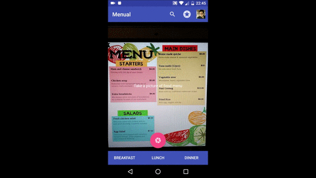
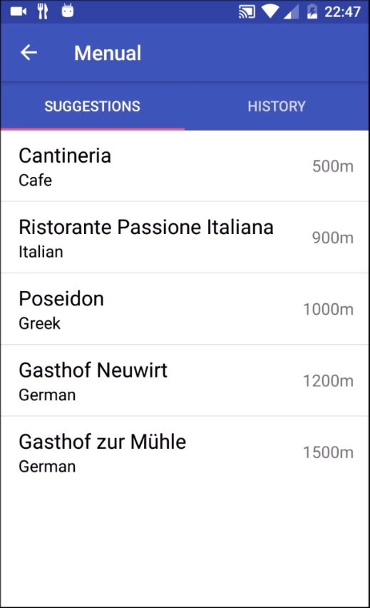

# Menual - Android App that supports users sticking to a healthy diet in daily life

Users who are not aware of the healthiness of dishes in a restaurant can take a photo of its menu. Menual identifies all dishes on the menu, looks dishes up on a food database and gives feedback and explanations whether each dish is healthy or not according to the German Nutrition Society's (DGE) standards.

Tools used: Android Studio, Firebase, Google Cloud Vision API, Nutritionix API

## Demos

### Appflow

### Meal Statistics

## Software Architecture

The Frontend is implemented using Android Studio and Firebase. We use Google Text Detection API to detect the text on a menu. Menual then filters dishes from other text such as ingridients or headlines. It sends all detected menus to the NutritionX API which returns deatils information on nutrients and vitamins for a dish. Based on these values, Menual calcualtes a food score for each dish according to the German Nutrition Society's (DGE).  

## Screenshots

### Sign-in Screen

### Main Screen

### Dish Detection

### Meal Evaluation

## Additional Features

### Diet Preferences
Users can choose from different diet preferences such as low-carb food, or vegeterian food and allergies. These preferences influence the score of a dish.

### Suggestions (Alpha)

Restaurants that have many healthy dishes and are nearby a user get recommended.

